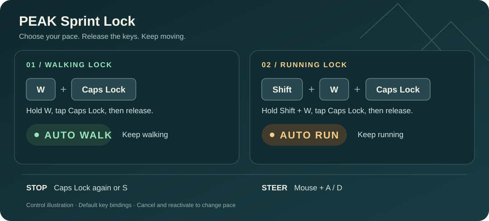

  

<h1 align="center">PEAK Sprint Lock</h1>

<strong>Keep moving. Give your fingers a break.</strong> 
Lock walking or running, release the keys, and keep steering.

  
  
  

  <a href="https://thunderstore.io/c/peak/p/Rachel560lu/PeakSprintLock/">Download</a> ·
  <a href="README.zh-CN.md">简体中文</a> ·
  <a href="https://github.com/Rachel560lu/peak-sprint-lock/issues">Report an issue</a>

## Walk or run. Your choice.

- **Two modes:** capture walking or running when you activate the lock.
- **Stay in control:** steer with the mouse, strafe and jump while moving.
- **Stop on demand:** press the toggle again or move backward to cancel.

*Default-key control illustration.*

## Quick controls

Hold the movement keys, press **Caps Lock**, then release. The HUD shows **AUTO WALK** or **AUTO RUN**.

| Default keys | Action |
| --- | --- |
| W + Caps Lock | Lock walking |
| Shift + W + Caps Lock | Lock running |
| Caps Lock or S | Cancel the lock |

Movement follows your in-game key bindings. The selected mode stays fixed until cancelled; to switch modes, cancel and activate again. Mouse steering, A/D strafing and jumping remain available.

## Install

1. Select **PEAK** in your Thunderstore-compatible mod manager.
2. Install [**PeakSprintLock**](https://thunderstore.io/c/peak/p/Rachel560lu/PeakSprintLock/) and its **BepInExPack_PEAK** dependency.
3. Launch with **Start modded**, enter the game and try the controls above.

Manual installation and removal

With the game closed, place `PeakSprintLock.dll` in `BepInEx/plugins/PeakSprintLock/` inside an existing BepInEx 5 PEAK profile. Start the game through that modded profile. Do not overwrite game assemblies.

To uninstall, close the game and remove the mod through your manager or delete its plugin folder.

## Good to know

The lock cancels when climbing (including ropes and vines), crouching, becoming incapacitated or dying, opening blocking menus/wheels, pausing, switching away from the game or changing scenes. It never resumes automatically. By default, empty stamina cancels **running** lock only.

You still steer and choose your route: this mod does not avoid obstacles or stop at cliffs. Caps Lock may also change your system's capitalization state; you can change the toggle key.

Configuration

The first launch creates `BepInEx/config/dev.midor.peaksprintlock.cfg`.

| Setting | Purpose |
| --- | --- |
| `ToggleKey` | Change the lock key using a Unity Input System Key name |
| `RequireForward` | Control whether activation requires forward input |
| `ShowHud` | Show or hide the lock status |
| `CancelWhenOutOfStamina` | Control cancellation of running lock at empty stamina |

**Compatibility:** walking and running passed local gameplay testing on **PEAK 2.4.b / 3e62ee214**. Activation uses the keyboard. Multiplayer, controller use and compatibility with other movement/input mods have not been verified. See the [verification record](docs/verification.md).

## More

[Development & testing](docs/development.md) · [Changelog](CHANGELOG.md) · [Report an issue](https://github.com/Rachel560lu/peak-sprint-lock/issues)

For bug reports, include your PEAK version, mod version, other installed mods and steps to reproduce. No open-source license is currently included.
