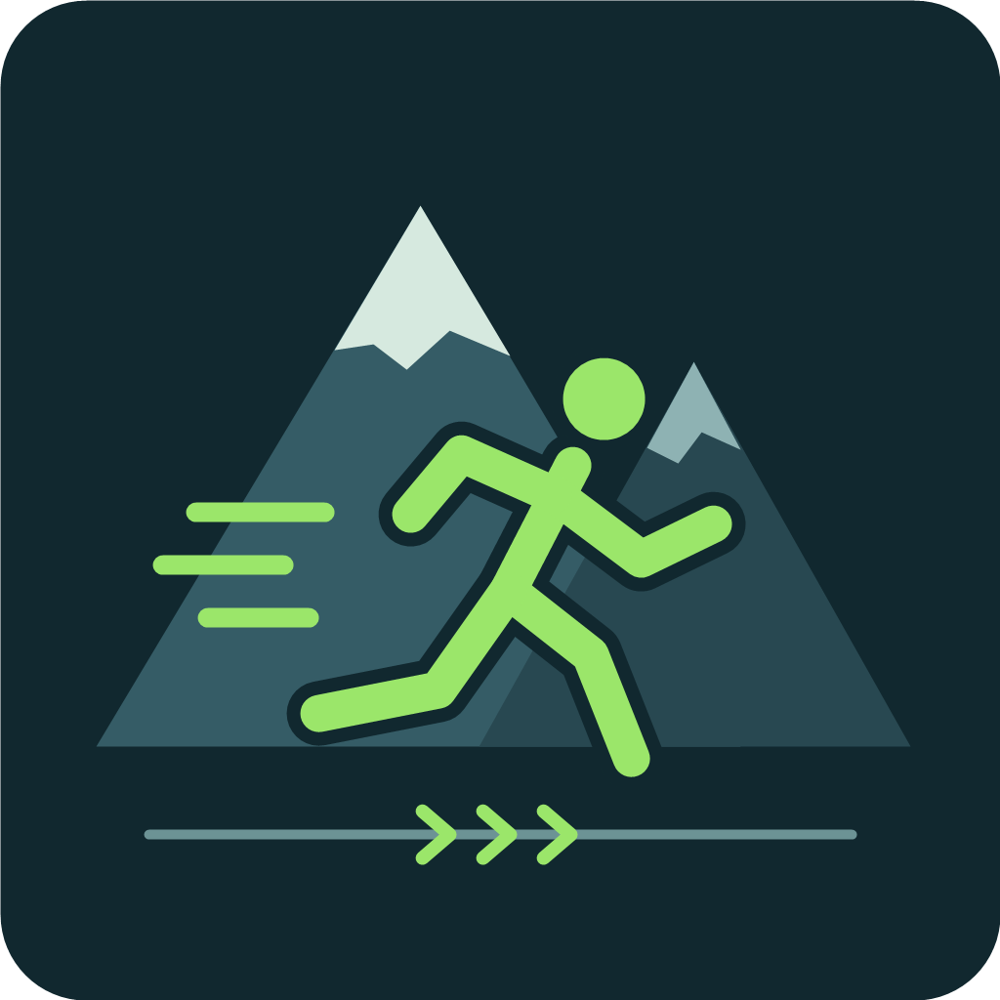

  

<h1 align="center">PEAK Sprint Lock</h1>

<strong>松开按键，继续前进。</strong> 
锁定走路或奔跑，让手指休息，方向依然由你掌握。

  
  
  

  <a href="https://thunderstore.io/c/peak/p/Rachel560lu/PeakSprintLock/">下载 Mod</a> ·
  <a href="README.md">English</a> ·
  <a href="https://github.com/Rachel560lu/peak-sprint-lock/issues">反馈问题</a>

## 走路还是奔跑，由你选择

- **两种模式：** 开启时选择走路或奔跑，松开按键后保持。
- **自由操控：** 持续移动时，仍可用鼠标转向、横移和跳跃。
- **随时停止：** 再按开关键或按后退键，即可取消锁定。

*默认按键操作示意图：W＋Caps Lock 锁定走路，Shift＋W＋Caps Lock 锁定奔跑。*

## 快速操作

按住移动键，按下 **Caps Lock**，然后松开按键。HUD 会显示 **AUTO WALK**（走路锁定）或 **AUTO RUN**（奔跑锁定）。

| 默认按键 | 效果 |
| --- | --- |
| W + Caps Lock | 锁定走路 |
| Shift + W + Caps Lock | 锁定奔跑 |
| Caps Lock 或 S | 取消锁定 |

移动操作跟随游戏内的按键设置。模式在开启时确定；锁定期间按下或松开 Shift 不会切换模式，需要先取消再重新开启。鼠标转向、A/D 横移和跳跃仍然可用。

## 安装

1. 在支持 Thunderstore 的 Mod 管理器中选择 **PEAK**。
2. 安装 [**PeakSprintLock**](https://thunderstore.io/c/peak/p/Rachel560lu/PeakSprintLock/) 及其依赖 **BepInExPack_PEAK**。
3. 点击 **Start modded** 启动游戏，进入游戏后尝试上面的按键组合。

手动安装与卸载

退出游戏后，将 `PeakSprintLock.dll` 放入已有 BepInEx 5 PEAK 配置的 `BepInEx/plugins/PeakSprintLock/`，再通过该 Mod 配置启动游戏。不要覆盖游戏程序集。

卸载时先退出游戏，通过 Mod 管理器移除，或删除该插件文件夹。

## 使用须知

攀爬（包括绳索和藤蔓）、蹲下、昏迷、死亡、打开阻挡输入的菜单或轮盘、暂停、切出游戏和切换场景时，锁定会取消，且不会自动恢复。默认情况下，体力耗尽只取消**奔跑锁定**。

路线和方向仍由你掌握：Mod 不会自动避障或在悬崖边刹车。Caps Lock 也可能改变系统大小写状态，可在配置中更换开关键。

配置选项

首次启动后生成 `BepInEx/config/dev.midor.peaksprintlock.cfg`。

| 设置 | 用途 |
| --- | --- |
| `ToggleKey` | 更改开关键，填写 Unity Input System 的 Key 名称 |
| `RequireForward` | 设置开启时是否必须按住前进键 |
| `ShowHud` | 显示或隐藏锁定状态 |
| `CancelWhenOutOfStamina` | 设置体力耗尽时是否取消奔跑锁定 |

**兼容性：** 走路和奔跑已在 **PEAK 2.4.b / 3e62ee214** 通过本机实机测试。目前通过键盘开启；联机、手柄及其他移动或输入 Mod 的兼容性尚未验证。详见[验证记录](docs/verification.md)。

## 更多

[开发与测试](docs/development.md) · [更新日志](CHANGELOG.md) · [反馈问题](https://github.com/Rachel560lu/peak-sprint-lock/issues)

反馈问题时，请附上 PEAK 版本、Mod 版本、其他已安装 Mod 和复现步骤。当前仓库不包含开源许可证。
